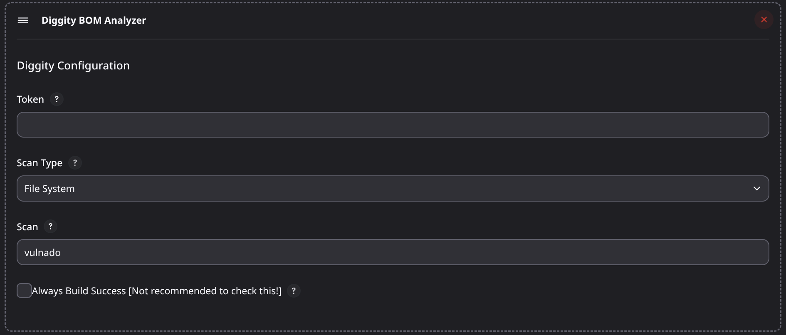

<p align="center">

</p>

[](https://github.com/carbonetes/diggity)
[]
# Jenkins Plugin: Diggity

## Introduction
<br>

[Diggity](https://github.com/carbonetes/diggity) provides organizations with a comprehensive view of their applications to enable informed decision-making and improve security posture. Its primary purpose is to scan for bill-of-materials, licenses, and exposed secrets.

This Jenkins plugin scans a specified target and exposes its dependencies, licenses and exposed secrets.


# Plugin Configuration Fields and Descriptions
## Scan Type
<b>Description: </b>Specified the input on scan field based on the selected scan type.
<br>
<b>Option:</b>
- `Image`: Provide the image:tag.
- `File System`: Provide the target filesystem directory path.
- `Tarball`: Provide the target tarball file path.

## Scan
<b>Input: </b> Image:tag, File System Directory Path, or Tar Ball File Path.

## Skip Build Fail
Default value is `false / unchecked`.
<br>
<b>Warning:</b> If the value is checked, it will restrict the plugin from failing the build based on the analysis result.

# Output


# Usage as Pipeline
```yaml
pipeline {
    agent any
    stages {
        stage('Diggity Scan') {
            steps {
                script {
                    diggity(
                        scanType: 'image',           // Choose Scan Type: image, directory, tar, or sbom.
                        scanName: 'ubuntu',          // Input: image:tag, filesystem dir path, or tarball file path.
                        skipFail: false,             // Default as false. Always Build Success [Not recommended to set true!]
                        token: ''                    // Personal access token
                    )
                }
            }
        }
    }
}
```
# Usage as Build Step


# LICENSE

Licensed under MIT, see [LICENSE](LICENSE.md)

